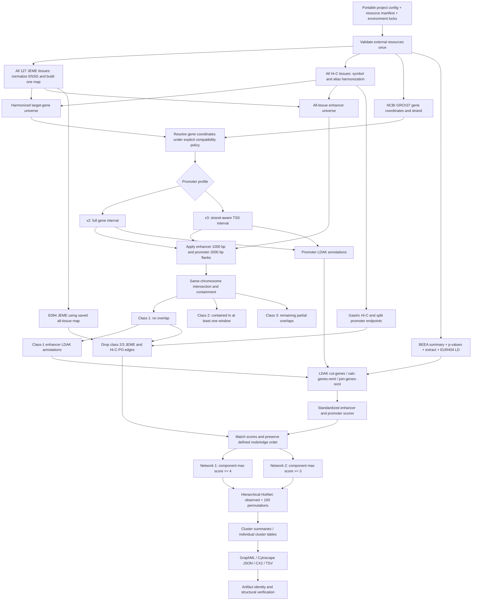

# Analysis workflow

## End-to-end schematic

Class 2 has precedence when one window fully contains an enhancer and another
partially overlaps it. Overlap is tested against all same-chromosome target
windows, independently of the enhancer's linked JEME target. Hi-C-PP edges
remain eligible. Both profiles disable ARACNe.

## Module ownership

| Scientific decision | Single owner | Consumers |
|---|---|---|
| Resource identity and location | resources | importers and provenance |
| Identifier policy and ambiguity | harmonization | annotations and network edges |
| Interval meaning and flanks | intervals | classifier, LDAK writer, audits |
| Enhancer class precedence | classification | annotation filter and edge gate |
| Regional p-value to score | scores | node construction and exports |
| Ordering and duplicate policy | network construction | numeric indexes and graphs |
| Resume validity | execution | LDAK and HotNet stages |
| Equality policy | reproducibility | regression tests and release reports |

The interval module must explicitly represent legacy differences between
classification coordinates and LDAK interpretation; a diagram of the desired
flow does not establish that historical coordinate arithmetic was consistent.
See decisions.md before implementing interval conversion.

## Runtime sequence

`initialize project -> provision inputs/tools -> import -> harmonize ->
annotate -> classify -> LDAK -> summarize -> networks -> HotNet -> export ->
verify`.

The finished installed package provides the sequence through documented public
functions and installed command-line entry points. Pure transformations return
tables; orchestration handles files, tools, stage fingerprints, and provenance.
